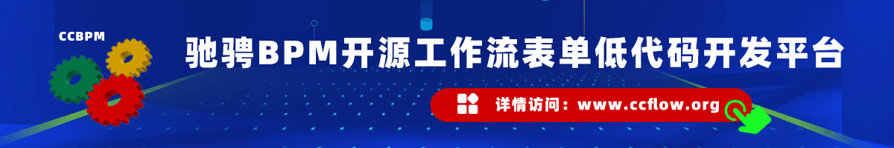

<div align="center">
	
	<p align="center">
		<a href="https://v3.vuejs.org/" target="_blank">
			
		</a>
		<a href="https://element-plus.gitee.io/#/zh-CN/component/changelog" target="_blank">
			
		</a>
		<a href="https://www.tslang.cn/" target="_blank">
			
		</a>
		<a href="https://vitejs.dev/" target="_blank">
		  
		</a>
		<a href="https://gitee.com/lyt-top/vue-next-admin/blob/master/LICENSE" target="_blank">
		  
		</a>
	</p>
	<p>&nbsp;</p>
</div>

#### 💝 长期赞助商

<a href="http://www.ccflow.org/" target="_blank">
	
</a>

#### 🌈 介绍 基础版 ts（不带国际化）

基于 vue3.x + CompositionAPI setup 语法糖 + typescript + vite + element plus + vue-router-next + pinia 技术，适配手机、平板、pc 的后台开源免费模板，希望减少工作量，帮助大家实现快速开发。

#### ⛱️ 线上预览

- vue3.x 版本预览（vue-next-admin）<a href="https://lyt-top.gitee.io/vue-next-admin-preview/#/login" target="_blank">https://lyt-top.gitee.io/vue-next-admin-preview/#/login</a>
- vue2.x 版本预览（vue-prev-admin）<a href="https://lyt-top.gitee.io/vue-prev-admin-preview/#/login" target="_blank">https://lyt-top.gitee.io/vue-prev-admin-preview/#/login</a>
- vue3.x + uni-app 商城 H5（vue-next-admin-shop）<a href="https://lyt-top.gitee.io/vue-next-admin-shop-preview" target="_blank">https://lyt-top.gitee.io/vue-next-admin-shop-preview</a>

#### 💒 代码仓库

- vue3.x 版本 <a href="https://gitee.com/lyt-top/vue-next-admin" target="_blank">https://gitee.com/lyt-top/vue-next-admin</a>
- vue2.x 版本 <a href="https://gitee.com/lyt-top/vue-next-admin/tree/vue-prev-admin" target="_blank">https://gitee.com/lyt-top/vue-next-admin/tree/vue-prev-admin</a>

#### 🚧 安装 cnpm、yarn

- 复制代码(桌面 cmd 运行) `npm install -g cnpm --registry=https://registry.npm.taobao.org`
- 复制代码(桌面 cmd 运行) `npm install -g yarn`

#### 🏭 环境支持

| Edge      | Firefox      | Chrome      | Safari      |
| --------- | ------------ | ----------- | ----------- |
| Edge ≥ 88 | Firefox ≥ 78 | Chrome ≥ 87 | Safari ≥ 13 |

> 由于 Vue3 不再支持 IE11，故而 ElementPlus 也不支持 IE11 及之前版本。

#### ⚡ 使用说明

建议使用 cnpm，因为 yarn 有时会报错。<a href="http://nodejs.cn/" target="_blank">node 版本 > 14.18+/16+</a>

> Vite 不再支持 Node 12 / 13 / 15，因为上述版本已经进入了 EOL 阶段。现在你必须使用 Node 14.18+ / 16+ 版本。

```bash
# 克隆项目
git clone https://gitee.com/lyt-top/vue-next-admin.git

# 进入项目
cd vue-next-admin

# 切换分支
git checkout vue-next-admin-template

# 安装依赖
cnpm install

# 运行项目
cnpm run dev

# 打包发布
cnpm run build
```

#### 📚 开发文档

- 查看开发文档：<a href="https://lyt-top.gitee.io/vue-next-admin-doc-preview" target="_blank">vue-next-admin-doc</a>

#### 📚 目录结构图

├── vueNextAdmin
	├── public (存放浏览器标题favicon.ico、静态json数据)
	│
	├── src (存放视图、工具类、image)
	│	├── api (与服务端对接的接口函数定义。建议视图文件夹与api文件夹相同，如login文件夹)
	│	│   ├── login (登录接口函数)
	│	│   └── menu (菜单接口函数)
	│	│
	│	├── assets (本地静态资源：图片、svg等)
	│	│
	│	├── components (存放公用全局组件)
	│	│   ├── auth (鉴权)
	│	│   ├── cropper (裁剪图片)
	│	│   ├── editor (富文本编辑器)
	│	│   ├── iconSelector (图标选择器)
	│	│   ├── noticeBar (滚动通知)
	│	│   ├── svgIcon (自定义封装 svg 图标)
	│	│   └── table (自定义封装 table)
	│	│
	│	├── directive (自定义指令内容)
	│	│
	│	├── i18n (存放框架国际化内容)
	│	│   ├── lang (框架内置国际化)
	│	│   └── pages (自定义国际化)
	│	│       ├── formI18n (表单)
	│	│       ├── home (首页)
	│	│       └── login (登录页)
	│	│
	│	├── layout (存放框架布局视图)
	│	│   ├── component (布局公用组件)
	│	│   ├── footer (页脚)
	│	│   ├── lockScreen (锁屏)
	│	│   ├── logo (logo)
	│	│   ├── main (主布局)
	│	│   ├── navBars (顶栏信息)
	│	│   │   ├── topBar (面包屑、关闭全屏、菜单搜索、布局配置、用户信息、消息通知)，（v2.4.33版本改）
	│	│   │   └── tagsView (标签页)
	│	│   ├── navMenu (导航菜单)
	│	│   ├── routerView (路由视图出口、外链、iframe内嵌)
	│	│   ├── upgrade (版本升级提示组件)
	│	│   └── sponsors (赞助商组件)
	│	│
	│	├── mock (存放模拟数据，非mock.js。用于城市多级联动)
	│	│
	│	├── router (存放路由信息)
	│	│
	│	├── stores (存放组件的状态 pinia)
	│	│
	│	├── theme (存放框架样式)
	│	│   ├── common (基础样式)
	│	│   ├── media (媒体查询)
	│	│   └── mixins (scss混入)
	│	│
	│	├── types (ts 类型定义文件)
	│	│   ├── axios.d.ts (扩展 axios 数据返回类型，可自行扩展)
	│	│   ├── global.d.ts (全局 ts 类型定义申明)
	│	│   ├── layout.d.ts (layout 布局 ts 类型定义申明)
	│	│   ├── mitt.d.ts (mitt 事件总线 ts 类型定义申明)
	│	│   ├── pinia.d.ts (pinia ts 类型定义申明)
	│	│   └── views.d.ts (views 视图各界面 ts 类型定义申明)
	│	│
	│	├── utils (存放工具类函数)
	│	│
	│	└── views (存放页面视图)
	│			├── chart (大数据图表演示)
	│			├── error (404、401)
	│			├── fun (功能演示)
	│			│   ├── clipboard (复制剪切)
	│			│   ├── countup (countup 数字滚动)
	│			│   ├── cropper (cropper 图片裁剪)
	│			│   ├── echartsMap (地理坐标/地图)
	│			│   ├── gridLayout (拖拽布局)
	│			│   ├── printJs (页面打印)
	│			│   ├── qrcode (qrcode 二维码生成)
	│			│   ├── splitpanes (窗格拆分器)
	│			│   ├── tagsView (tagsView 操作)
	│			│   └── wangEditor (wangEditor 编辑器)
	│			├── home (首页)
	│			├── limits (权限管理演示)
	│			│   ├── backEnd (后端控制)
	│			│   │   └── page (页面权限)
	│			│   └── frontEnd (前端控制)
	│			│       ├── btn (按钮权限)
	│			│       └── page (页面权限)
	│			├── login (登录界面)
	│			│   └── component (登录界面组件)
	│			├── menu (菜单嵌套演示)
	│			│  ├── menu1 (menu1)
	│			│  │  ├── menu11 (menu11)
	│			│  │  ├── menu12 (menu12)
	│			│  │  │   ├── menu121 (menu121)
	│			│  │  │   └── menu122 (menu122)
	│			│  │  └── menu13 (menu13)
	│			│  └──  menu2 (menu2)
	│			├── pages (页面演示)
	│			│   ├── awesome (awesome 字体图标)
	│			│   ├── drag (拖动指令)
	│			│   ├── dynamicForm (动态复杂表单)
	│			│   ├── element (element 字体图标)
	│			│   ├── filtering (过滤筛选组件)
	│			│   ├── formAdapt (表单自适应)
	│			│   ├── formI18n (表单国际化)
	│			│   ├── formRules (多表单验证)
	│			│   │   └── component (多表单验证各组件)
	│			│   ├── iocnfont (iconfont 字体图标)
	│			│   ├── lazyImg (图片懒加载)
	│			│   ├── listAdapt (列表自适应)
	│			│   ├── preview (大图预览)
	│			│   ├── steps (步骤条)
	│			│   ├── tableRules (表单表格验证)
	│			│   ├── tree (树形改表格)
	│			│   ├── waterfall (瀑布屏)
	│			│   └── workflow (工作流)
	│			│       └── component (工作流组件)
	│			│           ├── contextmenu (工作流右键菜单)
	│			│           └── drawer (工作流拖拽组件)
	│			├── make (组件封装)
	│			│   ├── selector (图标选择器)
	│			│   ├── noticeBar (滚动通知栏)
	│			│   ├── svgDemo (svg 演示)
	│			│   └── tableDemo (自定义封装 table)
	│			├── params (路由参数演示)
	│			│   ├── common (普通路由)
	│			│   └── dynamic (动态路由)
	│			├── personal (个人中心)
	│			├── system (系统设置)
	│			│   ├── menu (菜单管理)
	│			│   │   └── component (菜单管理组件)
	│			│   └── user (用户管理)
	│			├── tools (工具类集合)
	│			└── visualizing (数据可视化)
	│
	├── .env (全局默认配置文件，无论什么环境都会加载合并)
	├── .env.development (开发环境的配置文件)
	├── .env.production (生产环境的配置文件)
	├── .eslintignore (eslint忽略配置)
	├── .eslintrc.js (eslint配置)
	├── .gitignore (git提交忽略配置)
	├── .prettierrc.js (prettier代码格式化配置)
	├── CHANGELOG.md (框架更新日志)
	├── index.html (用户页面访问入口)
	├── LICENSE (开源许可证)
	├── package-lock.json (npm锁定安装时的包的版本号)
	├── package.json (包的依赖管理配置文件)
	├── README.md (框架介绍文件)
	├── tsconfig.json (ts配置文件)
	└── vite.config.ts (vite配置文件)
